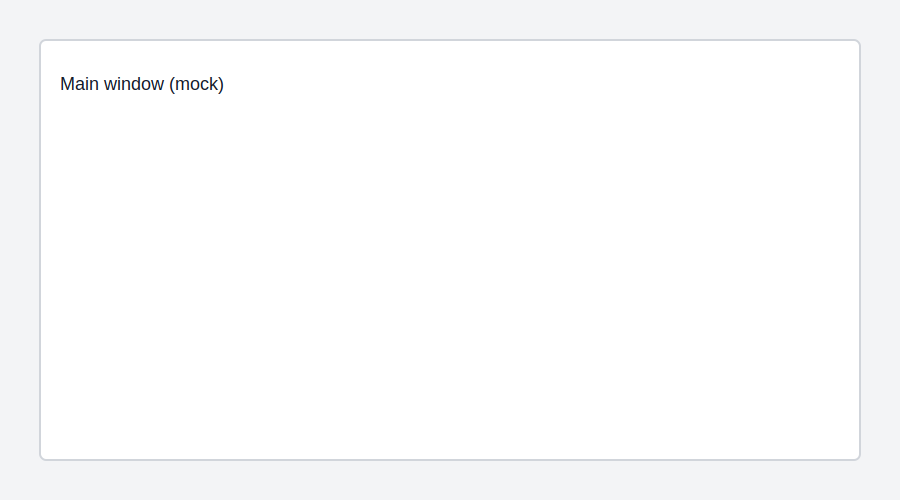

## SSF2 Mod Manager v1 — Stable release

Today we’re excited to announce the first stable release of SSF2 Mod Manager. This release brings:

- One-click compatible installs for many GameBanana packages.
- Lightweight `info.json` support for mod metadata (creator, target SSF2 version, mod type).
- Runtime themes and a new Theme Manager with improved dark/friendly themes.
- Improved dialogs and a redesigned Builds page with quick download links.

### What’s new

- Improved installer that reads `info.json` inside archives and displays author and target version during install.
- New `News` support in the app (coming soon): fetch official release notes and screenshots directly from our repository.
- Multiple UI and accessibility fixes across dialogs and selection lists.

### Screenshots

### How to get it

Download the latest build from the Releases page (or add the build in the Installed Builds page).

### For contributors

To write a News article, open a PR adding a new folder under `News/` named `YYYY-MM-DD-your-slug/`, include `article.md` (frontmatter + Markdown) and image files. We recommend keeping images under 1–2 MB and providing alt text for accessibility.
