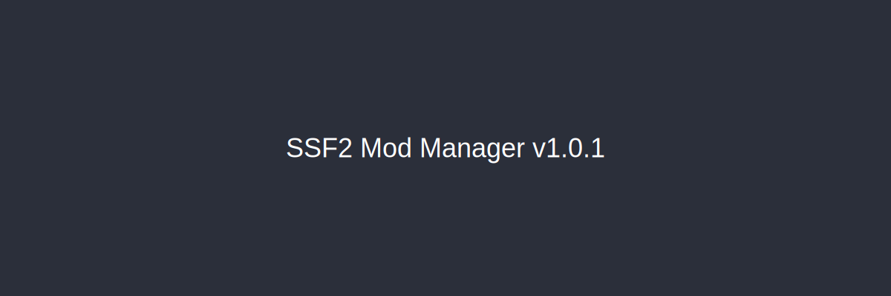

## What's improved in v1.0.1

This is a small polish release after **v1.0.0**. No new major features — just fixes and quality-of-life improvements.

### Themed popup windows

Install and settings dialogs (including **Target Version** when you install a mod) now respect your chosen theme instead of staying on the default dark blue look.

### 1-Click install docs

Documentation now matches what GameBanana sends for `ssf2mm:` links: the middle field is **ModelName** (usually `Mod`), not the mod's category name like Maps or Characters.

### Other fixes

- **Cancel** works again on the Target Version picker and other popup dialogs
- `run.bat` closes any already-running instance before launching a new dev build

## Getting the update

Download the latest zip from [GitHub Releases](https://github.com/SSF2-Mods-Official/SSF2ModManager/releases) and replace your existing folder, or let the in-app update check point you there.

Thanks for using SSF2 Mod Manager!
