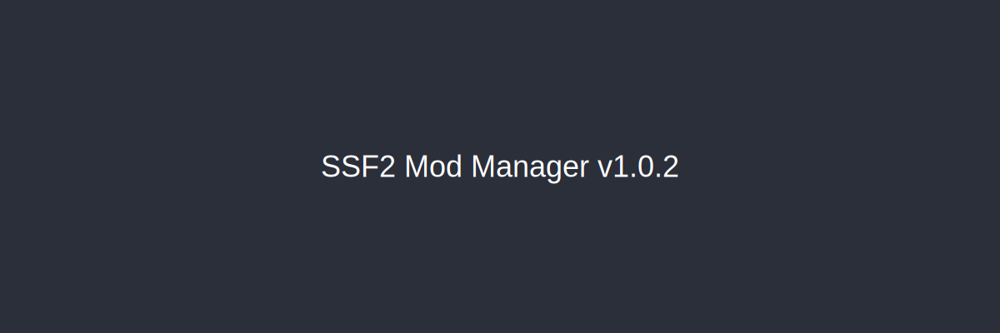

## GameBanana 1-Click — please update

**Sorry — v1.0.0 and v1.0.1 do not work with GameBanana 1-Click.** Those builds could not handle the URL format the site sends (`/mmdl/` links and the broken `https//` scheme). **You need v1.0.2** for 1-Click install.

**v1.0.2** adds full support:

- `/mmdl/` download URLs (what GameBanana actually sends)
- Malformed launcher URLs like `ssf2mm://https//gamebanana.com/mmdl/...`
- Matching files by ID so `/mmdl/` and `/dl/` are interchangeable

```text
ssf2mm:https://gamebanana.com/mmdl/1708765,Mod,679407
```

Manual install from Browse still worked on older versions — only 1-Click needed this update.

## Other fixes

- **Filters stick** when you enable/disable mods on the Installed page
- **Update downloads** show the progress bar again
- **Remote news sync** — new articles download from GitHub on startup (Refresh on the News page forces a sync)
- **Unread badge** on the News sidebar button; **Mark all read** on the News page
- **Missing mod folder** — enabling a mod whose files were deleted now shows a popup with an option to re-download from GameBanana

## Getting the update

Download the latest zip from [GitHub Releases](https://github.com/SSF2-Mods-Official/SSF2ModManager/releases) or use the in-app update check.
